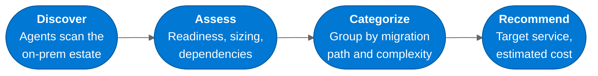

:::tip[TL;DR]
Azure Migrate assesses the full estate — VMs, .NET apps, and SQL databases —
producing evidence-based recommendations for each workload. The migrate-as-is,
remediate, modernize, and retire mix is customer-specific and should come from
discovery, readiness, dependency, sizing, and cost evidence.
:::

Strategy gave us direction. Now we need evidence. **Azure Migrate** provides
a comprehensive, automated assessment of the entire estate — infrastructure,
applications, and databases — so we can make informed decisions about what
moves, how it moves, and in what order.

## MCEM Stage 2 — Inspire and Design

This is **MCEM Stage 2: Inspire and Design**. We show the customer what is
possible and begin shaping the solution. The assessment transforms abstract
modernization goals into concrete, workload-specific recommendations backed
by data — setting the stage for horizons design.

## Decide, Plan, and Execute Evidence

Azure Migrate supports the decide, plan, and execute story for migration and
modernization. Discovery creates the inventory. Business cases and assessments
turn that inventory into readiness, right-sizing, cost, dependency, and target
recommendations. Wave planning then converts those recommendations into an
execution plan. Use the official [Azure Migrate overview][azure-migrate-overview]
and [migration planning guidance][azure-migrate-planning] as the source for
assessment scope and readiness interpretation.

## Three Dimensions of Assessment

Azure Migrate assesses the estate across three dimensions. Each dimension
produces findings that must be reviewed with application owners and platform
teams before the roadmap is approved.

### Infrastructure

- How many VMs are running, and what are their actual utilization patterns?
- Which VMs are right-sized, which are oversized, which are idle?
- What operating system versions are in use — and are any end-of-support?
- What are the network dependencies between servers?

### Applications

- What .NET Framework versions are the applications built on?
- Which applications are IIS-hosted web apps vs. Windows services?
- What are the application-to-database dependencies?
- How complex would it be to modernize each application?

### Databases

- What SQL Server versions and editions are running?
- What features are in use (CLR, linked servers, Service Broker)?
- What is the database size and performance profile?
- What is the compatibility level with Azure SQL targets?

## What the Assessment Reveals

A good assessment replaces assumptions with explicit migration evidence:

| Evidence area              | What to use it for                                                |
| -------------------------- | ----------------------------------------------------------------- |
| **Azure readiness**        | Identify workloads that are ready, conditionally ready, or blocked |
| **Right-sizing**           | Compare as-is sizing with performance-based sizing                 |
| **Cost estimation**        | Build customer-specific run-rate and TCO projections               |
| **Dependency analysis**    | Group systems that must move together in the same wave             |
| **Target recommendations** | Compare Azure VM, SQL MI, Azure SQL DB, and modernization options  |
| **Retirement candidates**  | Remove idle, redundant, or ownerless assets from the plan          |

:::tip[The assessment is not just a migration tool]
Many customers discover workloads they did not know they had — shadow IT,
forgotten test environments, or services that nobody owns. The assessment
is often the first time an organization has a complete, accurate inventory
of its own estate.
:::

## From Assessment to Horizons

The assessment data feeds directly into the next phase: designing a
**Horizons-based roadmap** that matches each workload to the right
modernization path — whether that is a quick lift-and-shift (Horizon 1)
or a deeper cloud-native transformation (Horizon 2).

[← Back to Strategy](/dc2fabric/strategy/) · [Continue to Horizons →](/dc2fabric/horizons/)

[azure-migrate-overview]: https://learn.microsoft.com/azure/migrate/migrate-services-overview
[azure-migrate-planning]: https://learn.microsoft.com/azure/migrate/concepts-migration-planning
