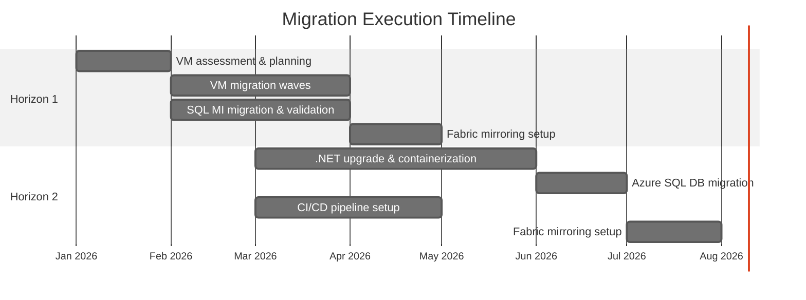
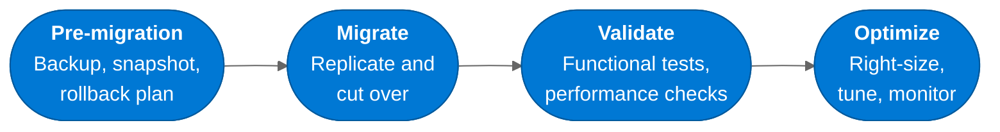

:::tip[TL;DR]
H1 runs in parallel with H2. VMs and SQL MI migrate in waves over weeks;
.NET containerization and Azure SQL DB take months. Every wave follows a
pre-migrate → migrate → validate → optimize guardrail. The customer team
builds cloud skills throughout.
:::

The roadmap is approved. The workloads are assigned to horizons. Now we
execute — methodically, with guardrails, and with continuous validation
at every step.

## MCEM Stage 3 — Empower and Achieve

This is **MCEM Stage 3: Empower and Achieve**. The customer team is enabled
to deliver the migration with Microsoft support, tooling, and best practices.
The goal is not just to move workloads — it is to build the customer's
capability to operate and evolve their Azure environment independently.

## Execution by Horizon

### Horizon 1 — Execution Steps

1. **Prepare landing zone** (CAF [Ready](https://learn.microsoft.com/azure/cloud-adoption-framework/ready/) phase) —
   Azure Virtual Network, NSGs, Azure Backup vaults, monitoring baselines
2. **Group dependencies into waves** — Keep dependent systems together,
   start with nonproduction or lower-risk workloads, and document owners,
   rollback criteria, and success measures for each wave
3. **Migrate VMs in waves** — Use Azure Migrate to replicate and cut over
   VMs in planned waves after stakeholder approval of the cutover window
4. **Migrate databases** — Use the Managed Instance link where SQL MI is the
   target and near-real-time replication is required. Downtime is limited to
   the final cutover window, when applications switch to the target endpoint.
   Use Azure Database Migration Service (DMS) or another approved method when
   compatibility, version, or process constraints require it
5. **Validate and optimize** — Run functional tests, validate performance,
   right-size VMs based on actual Azure utilization data
6. **Enable Fabric mirroring** — Configure SQL MI Mirroring to OneLake
   for workloads where analytics is a strategic priority

### Horizon 2 — Execution Steps

1. **Upgrade .NET applications** — Use the .NET Upgrade Assistant or the
   GitHub Copilot modernization agent to migrate from .NET Framework
   to .NET 8+, resolve breaking changes
2. **Containerize** — Create Dockerfiles, set up Azure Container Registry,
   configure Azure Container Apps environments
3. **Set up CI/CD** — Build GitHub Actions or Azure DevOps pipelines for
   automated build, test, and deployment
4. **Migrate databases** — Move to Azure SQL Database, adjust connection
   strings, validate query performance
5. **Enable Fabric mirroring** — Configure Azure SQL DB mirroring to OneLake

## Migration Guardrails

Every migration wave follows the same validation pattern:

:::caution[Never skip validation]
Every workload gets a validation checkpoint after migration. Functional
testing, performance benchmarking, and user acceptance — all before the
on-premises source is decommissioned. Rollback plans remain active until
validation is complete.
:::

## Wave Planning Discipline

CAF migration guidance and Azure Migrate wave planning both emphasize iterative
execution. Each wave should have:

- Dependency grouping validated by application owners and Azure Migrate data
- A nonproduction rehearsal or lower-risk production candidate before critical
   production workloads
- Migration method selection tied to workload requirements, not preference
- Planned cutover windows, rollback criteria, and stakeholder approval
- Post-cutover validation for functionality, performance, security, backup,
   monitoring, and business acceptance

Lessons from each wave should update later waves. This keeps the roadmap
evidence-based as new dependencies, constraints, and operating practices emerge.
Use CAF [migration planning][caf-migration-plan], CAF [wave planning][caf-wave-planning],
and [MI Link migration][mi-link-migration] guidance as the official execution
references.

## Building Customer Capability

Execution is also a learning opportunity. Throughout the migration, the
customer team builds skills in:

- Azure networking and security fundamentals
- Infrastructure-as-code (Bicep or Terraform)
- Container operations and CI/CD pipelines
- Fabric administration and analytics development
- Cost management and optimization practices

By the time the migration is complete, the customer does not just have
workloads in Azure — they have a team that knows how to operate them.

[← Back to Horizons](/dc2fabric/horizons/) · [Continue to Outcomes →](/dc2fabric/outcomes/)

[caf-migration-plan]: https://learn.microsoft.com/azure/cloud-adoption-framework/migrate/plan-migration
[caf-wave-planning]: https://learn.microsoft.com/azure/cloud-adoption-framework/migrate/migration-wave-planning
[mi-link-migration]: https://learn.microsoft.com/azure/azure-sql/managed-instance/managed-instance-link-migrate
