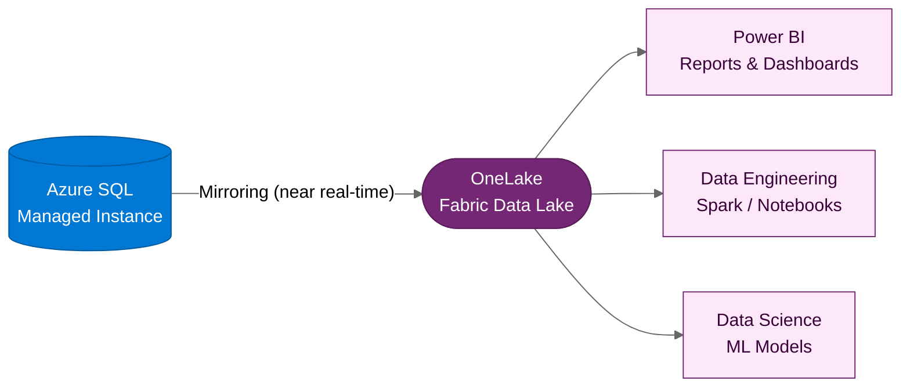

:::tip[TL;DR]
SQL MI Mirroring replicates operational data into Fabric’s OneLake in near
real time for supported tables. It can avoid custom ETL pipelines for mirrored
data and does not require application code changes, but production overhead,
networking, permissions, and unsupported features must be validated.
:::

Here is the multiplier on Horizon 1: with supported databases and the right
connectivity, operational data from SQL Managed Instance can be mirrored into
Microsoft Fabric for near-real-time analytics, reporting, and AI without custom
ETL pipeline development for the mirrored tables.

## SQL MI Mirroring to Fabric

SQL Managed Instance Mirroring creates a continuous, low-latency replication
of your database into Fabric's **OneLake** — the unified data lake that
underpins all Fabric workloads.

## Why This Matters

Traditional approaches to analytics often require building ETL pipelines,
maintaining a separate data warehouse, and accepting hours or days of data
latency. SQL MI Mirroring changes that design point for supported data:

| Traditional Approach              | With Mirroring                      |
| --------------------------------- | ----------------------------------- |
| Build and maintain ETL pipelines  | Configuration-based mirroring       |
| Hours or days of data latency     | Near-real-time (seconds to minutes) |
| Separate data warehouse to manage | Data lands directly in OneLake      |
| Duplicate extract stores          | Uses Fabric capacity and OneLake    |

## What You Unlock

Once data is in Fabric, the entire Fabric platform is available:

- **Power BI** — Interactive dashboards on mirrored operational data
- **Data Engineering** — Spark-based data transformation and enrichment
- **Data Science** — Machine learning models trained on production data
- **Real-Time Intelligence** — Event-driven analytics and alerting

:::note[Minimal disruption to the running application]
The production SQL MI instance continues to serve the application while Fabric
stores the replicated data for analytics. Validate source workload overhead,
replication lag, and Fabric capacity during readiness testing.
:::

:::caution[Mirroring caveats]
SQL MI source security settings do not automatically become Fabric security.
Row-level security, object or column permissions, and dynamic data masking are
not propagated into Fabric OneLake. Microsoft Purview Information Protection
sensitivity labels from SQL MI also are not mirrored. Recreate the required
Fabric permissions, labels, and policies before business users consume the data.
:::

Private SQL MI scenarios also need connectivity planning. If SQL MI is not
publicly accessible, use a virtual network data gateway or on-premises data
gateway that can reach the SQL MI private endpoint. Unsupported tables, column
types, schema features, tenant boundaries, or identity settings can block or
exclude mirroring, so run a readiness review before committing the analytics
timeline. Use the Microsoft Fabric [SQL MI mirroring limitations][sql-mi-limits]
and [SQL MI mirroring security][sql-mi-security] guidance during design.

:::note[Mirroring is one of two Fabric data access methods]
Fabric also supports **shortcuts** — a virtualization layer that provides
zero-copy access to data in Azure Data Lake Storage, Amazon S3, Dataverse,
and other sources without replicating it. For SQL MI, mirroring is the
primary mechanism; shortcuts complement it for non-SQL data sources.
:::

## When to Enable Mirroring

Mirroring makes sense when the customer's strategy includes:

- Business intelligence on operational data (not just historical snapshots)
- Cross-system analytics (combining data from multiple databases)
- AI/ML initiatives that need access to production-quality data
- Reducing the complexity of existing ETL/data warehouse infrastructure

If these are not strategic priorities today, mirroring can be enabled later
after readiness validation, permissions design, and capacity planning.

[← Back to H1 Lift & Shift](/dc2fabric/horizons/h1-lift-shift/) · [Next: H2 Modernize →](/dc2fabric/horizons/h2-modernize/)

[sql-mi-limits]: https://learn.microsoft.com/fabric/mirroring/azure-sql-managed-instance-limitations
[sql-mi-security]: https://learn.microsoft.com/fabric/mirroring/azure-sql-managed-instance-how-to-data-security
