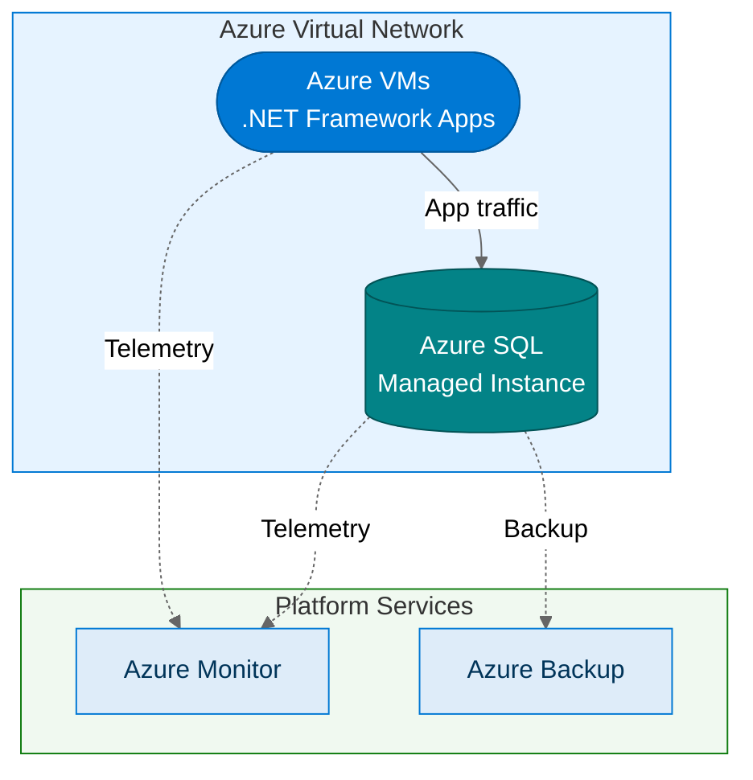

:::tip[TL;DR]
The Stabilize path migrates VMs to Azure and databases to SQL Managed Instance
in **4–8 weeks** for many small-to-mid estates, with low application-change risk.
Right-sizing, reservations, and managed database operations can improve cost
and resilience, but quantified savings should come from Azure Migrate and TCO
analysis for the customer estate.
:::

Stabilize is about getting to Azure quickly and safely. The applications do not
change. The databases stay compatible. But the infrastructure underneath becomes
modern, managed, and cost-optimized. In the underlying Horizons model, this path
maps to Horizon 1.

## What Moves

| On-Premises           | Azure Target                 | Migration Tool      |
| --------------------- | ---------------------------- | ------------------- |
| Windows Server VMs    | Azure Virtual Machines       | Azure Migrate       |
| SQL Server databases  | Azure SQL Managed Instance   | MI Link / Azure DMS |
| Network configuration | Azure Virtual Network + NSGs | Azure Migrate       |

## The Architecture

## Why SQL Managed Instance

SQL Managed Instance is the key to the Stabilize path. It provides near-100%
compatibility with on-premises SQL Server — which means databases move
without application code changes.

**What you keep:**

- SQL Agent jobs
- Cross-database queries
- CLR assemblies
- Linked servers (within the managed instance)
- Database mail

**What you gain:**

- Automated patching and backups
- Built-in high availability
- Transparent data encryption by default
- Elastic scaling without downtime
- Pay-per-use instead of upfront licensing

## Quick Wins

The Stabilize path delivers measurable value within weeks:

- **Right-sizing**: VMs are provisioned to match actual utilization,
  not peak-plus-headroom estimates from five years ago
- **Reserved instances**: Commit to 1-year or 3-year terms for
  eligible, predictable workloads after sizing is validated
- **Automated operations**: Patching, backups, and monitoring move
  from manual processes to managed services
- **Decommission on-premises**: Reduce data center footprint and
  associated facilities costs

## Before and After

| Dimension            | Before (On-Premises)              | After (Stabilize)                    |
| -------------------- | --------------------------------- | ------------------------------------ |
| **Infrastructure**   | Self-managed VMs, manual patching | Azure VMs with automated patching    |
| **Database**         | SQL Server (self-managed)         | SQL Managed Instance (fully managed) |
| **Backups**          | Manual, on-site                   | Automated, geo-redundant             |
| **Monitoring**       | Basic or manual                   | Azure Monitor with alerts            |
| **Cost model**       | CapEx, over-provisioned           | OpEx, right-sized                    |
| **Analytics**        | Manual spreadsheet exports        | SQL MI Mirroring → Fabric            |
| **Typical timeline** | —                                 | **4–8 weeks**                        |

:::note[Quantify savings per customer]
Use Azure Migrate business cases, Azure Migrate assessments, and the Azure TCO
Calculator to quantify savings. Percentages vary by utilization, license
position, SKU selection, region, reservations, and operational practices.
:::

:::tip[Stabilize is not a compromise]
Lift and shift is sometimes dismissed as "just moving the problem to the
cloud." But when done right — with proper right-sizing, reserved instances, and
managed database services — Stabilize delivers immediate, measurable business
value while buying time for deeper modernization where it matters most.
:::

## What Comes Next

Once workloads are running in Azure, you have two paths:

1. **Stay in Stabilize** — For stable, low-change workloads, this is the right answer.
   Add [Fabric integration via SQL MI Mirroring](/dc2fabric/horizons/h1-fabric/)
   to unlock analytics without any further changes.
2. **Evolve to Transform** — For workloads that need elasticity, modern DevOps, or
   cloud-native capabilities, plan a [Transform modernization](/dc2fabric/horizons/h2-modernize/).

[← Back to Modernization Paths](/dc2fabric/horizons/) · [Next: Stabilize + Fabric →](/dc2fabric/horizons/h1-fabric/)
