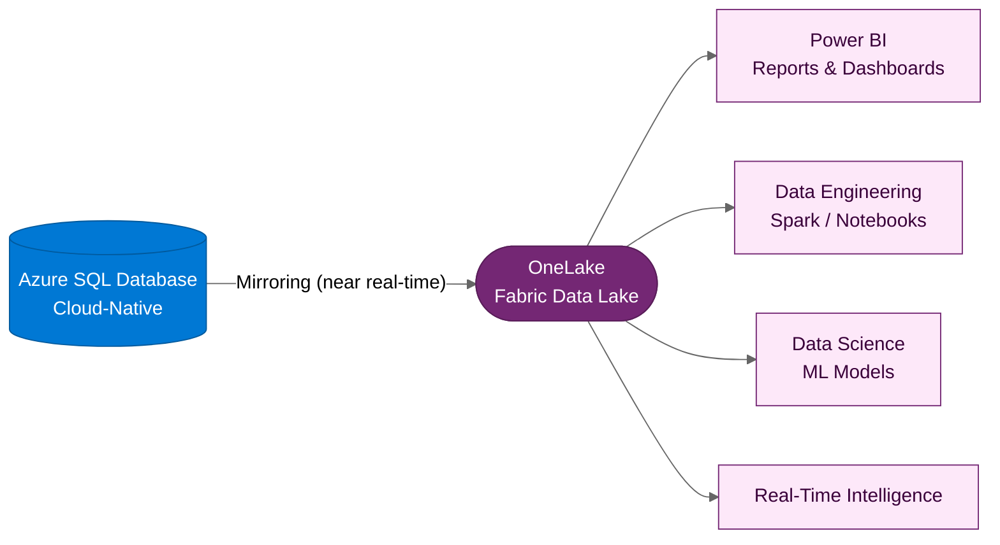

:::tip[TL;DR]
Modernized H2 apps produce richer data. Azure SQL DB mirroring to Fabric
combines cloud-native data models with governed analytics, ML, and real-time
intelligence when the source schema, permissions, and network design are ready.
:::

Horizon 2 applications produce richer, more granular data than their
legacy predecessors. With **Azure SQL Database mirroring to Fabric**,
that data flows directly into the unified data platform — ready for
analytics, AI, and cross-system insights.

## Azure SQL DB in Fabric

Like SQL MI Mirroring, Azure SQL Database can mirror its data into
Fabric's OneLake. But because H2 applications are typically more
modern in their data patterns, the Fabric integration unlocks
additional capabilities.

## Why H2 + Fabric is More Powerful

Modernized applications produce better data. Combined with Fabric,
this creates a compounding advantage:

| H1 + Fabric                              | H2 + Fabric                            |
| ---------------------------------------- | -------------------------------------- |
| Mirrors existing database schemas as-is  | Modern schemas optimized for analytics |
| Batch-oriented application data patterns | Event-driven, real-time data streams   |
| Analytics on legacy data structures      | Analytics on cloud-native data models  |
| BI dashboards and reports                | BI + ML + real-time intelligence       |

## The Unified Data Estate

Whether a customer follows Horizon 1, Horizon 2, or both, Fabric can become a
governed destination for supported operational and analytical data:

:::note[Fabric is the destination, not the detour]
This is why Fabric is central to the modernization story when analytics,
AI, and cross-system insight are part of the strategy. The customer can
standardize governance and consumption patterns instead of creating a separate
analytics operating model for each workload.
:::

## The Strategic Payoff

For the customer, this means:

- **One governed analytics platform** — Fewer duplicated extracts, pipelines,
  and analytics silos per application
- **Trusted data products** — Mirrored and shortcutted data becomes
  reusable, governed [data products](https://learn.microsoft.com/azure/cloud-adoption-framework/data/executive-strategy-unify-data-platform#key-terms)
  consumed across the organization for analytics and AI
- **AI-ready by design** — Data in OneLake can support machine learning,
  Copilot integrations, and advanced analytics once ownership, quality, and
  access controls are in place
- **Governed by design** — [Microsoft Purview](https://learn.microsoft.com/azure/cloud-adoption-framework/data/governance-security-baselines-purview-data-estate-unify-data-platform)
  provides unified data governance, classification, and policy enforcement
  across the entire data estate — OneLake, Azure, on-premises, and
  third-party sources
- **Incremental value** — H1 workloads contribute data to Fabric today;
  as they evolve to H2, the data gets richer — but the platform is already
  in place

:::caution[Mirroring is not security propagation]
Azure SQL Database row-level security, object or column permissions, and
dynamic data masking are not propagated into Fabric OneLake. Microsoft Purview
Information Protection sensitivity labels from Azure SQL Database are not
cascaded into Fabric either. Recreate the required Fabric security model,
labels, endorsement, and access reviews before publishing data products.
:::

Mirroring readiness also depends on supported table and column features,
identity settings, tenant boundaries, and connectivity. Treat Fabric as a
governed data-products platform: assign product owners, define consumer SLAs,
document lineage, and test replication behavior before promising analytics
availability to business teams.

Use the Microsoft Fabric [Azure SQL Database mirroring limitations][sql-db-limits]
and [Fabric adoption roadmap][fabric-adoption-roadmap] as design inputs.

:::note[Shortcuts complement mirroring]
For non-SQL data sources — Azure Data Lake Storage, Amazon S3, Dataverse,
and others — Fabric **shortcuts** provide zero-copy, virtualized access to
data without replicating it. Combined with mirroring for SQL sources, this
covers the full data estate.
:::

:::tip[CAF guidance for unified data platforms]
Microsoft's Cloud Adoption Framework outlines a [four-step framework](https://learn.microsoft.com/azure/cloud-adoption-framework/data/executive-strategy-unify-data-platform#how-do-you-unify-your-data-platform)
for unifying your data platform: Organizational readiness → Architecture
→ Governance and security baselines → Operational standards. Use this as
a reference when building out the customer's Fabric practice.
:::

## Operating Model

Fabric adoption needs more than mirrored databases. Align the platform to the
Fabric adoption roadmap: executive sponsorship, data culture, content ownership,
content delivery scope, a Center of Excellence, governance, mentoring, community
of practice, user support, system oversight, and change management.

For dc2fabric, that means every mirrored source should have a named data owner,
classification and access-review process, documented refresh or replication
expectations, and a support path for data consumers. The platform team provides
guardrails; business data-product owners make the data usable and trusted.

[← Back to H2 Modernize](/dc2fabric/horizons/h2-modernize/) · [Continue to Execution →](/dc2fabric/execution/)

[sql-db-limits]: https://learn.microsoft.com/fabric/mirroring/azure-sql-database-limitations
[fabric-adoption-roadmap]: https://learn.microsoft.com/power-bi/guidance/fabric-adoption-roadmap
