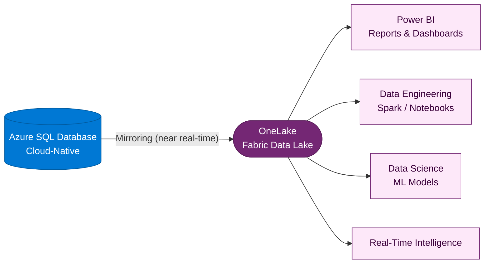
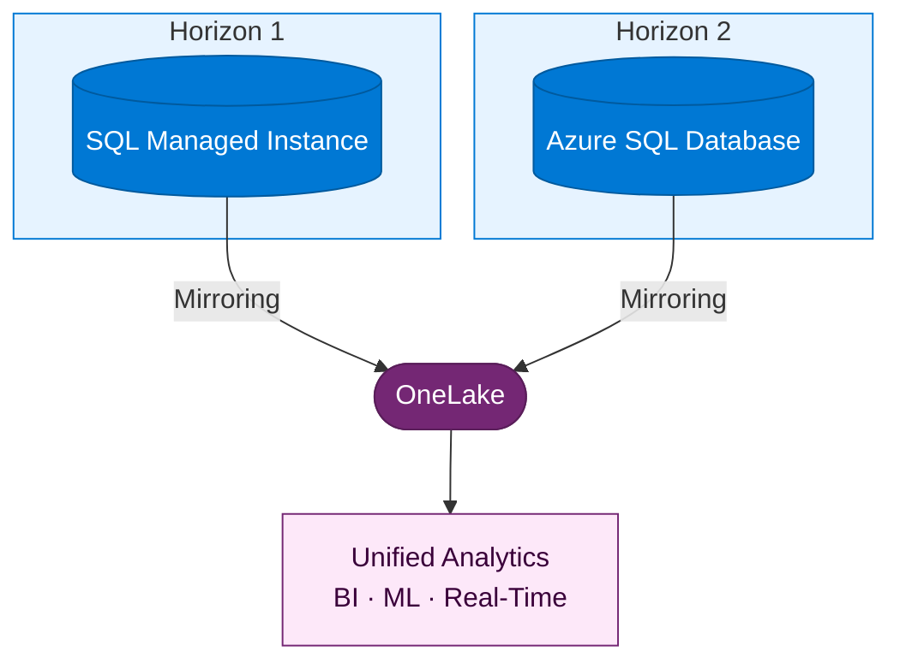

:::tip[TL;DR]
Modernized H2 apps produce richer data. Azure SQL DB mirroring to Fabric
combines cloud-native data models with ML, real-time intelligence, and
unified analytics — the full strategic payoff of modernization.
:::

Horizon 2 applications produce richer, more granular data than their
legacy predecessors. With **Azure SQL Database mirroring to Fabric**,
that data flows directly into the unified data platform — ready for
analytics, AI, and cross-system insights.

## Azure SQL DB in Fabric

Like SQL MI Mirroring, Azure SQL Database can mirror its data into
Fabric's OneLake. But because H2 applications are typically more
modern in their data patterns, the Fabric integration unlocks
additional capabilities.

## Why H2 + Fabric is More Powerful

Modernized applications produce better data. Combined with Fabric,
this creates a compounding advantage:

| H1 + Fabric                              | H2 + Fabric                            |
| ---------------------------------------- | -------------------------------------- |
| Mirrors existing database schemas as-is  | Modern schemas optimized for analytics |
| Batch-oriented application data patterns | Event-driven, real-time data streams   |
| Analytics on legacy data structures      | Analytics on cloud-native data models  |
| BI dashboards and reports                | BI + ML + real-time intelligence       |

## The Unified Data Estate

Whether a customer follows Horizon 1, Horizon 2, or both — Fabric
becomes the single destination for all operational data:

:::note[Fabric is the destination, not the detour]
This is why Fabric is central to the modernization story — not an
optional add-on. Regardless of which horizon a workload follows,
the data converges in Fabric. The customer builds one analytics
platform, not two.
:::

## The Strategic Payoff

For the customer, this means:

- **One data platform** — No more separate data warehouses, ETL pipelines,
  or analytics silos per application
- **Trusted data products** — Mirrored and shortcutted data becomes
  reusable, governed [data products](https://learn.microsoft.com/azure/cloud-adoption-framework/data/executive-strategy-unify-data-platform#key-terms)
  consumed across the organization for analytics and AI
- **AI-ready by default** — Data in OneLake is immediately available for
  machine learning, Copilot integrations, and advanced analytics
- **Governed by design** — [Microsoft Purview](https://learn.microsoft.com/azure/cloud-adoption-framework/data/governance-security-baselines-purview-data-estate-unify-data-platform)
  provides unified data governance, classification, and policy enforcement
  across the entire data estate — OneLake, Azure, on-premises, and
  third-party sources
- **Incremental value** — H1 workloads contribute data to Fabric today;
  as they evolve to H2, the data gets richer — but the platform is already
  in place

:::note[Shortcuts complement mirroring]
For non-SQL data sources — Azure Data Lake Storage, Amazon S3, Dataverse,
and others — Fabric **shortcuts** provide zero-copy, virtualized access to
data without replicating it. Combined with mirroring for SQL sources, this
covers the full data estate.
:::

:::tip[CAF guidance for unified data platforms]
Microsoft's Cloud Adoption Framework outlines a [four-step framework](https://learn.microsoft.com/azure/cloud-adoption-framework/data/executive-strategy-unify-data-platform#how-do-you-unify-your-data-platform)
for unifying your data platform: Organizational readiness → Architecture
→ Governance and security baselines → Operational standards. Use this as
a reference when building out the customer's Fabric practice.
:::

[← Back to H2 Modernize](/dc2fabric/horizons/h2-modernize/) · [Continue to Execution →](/dc2fabric/execution/)
