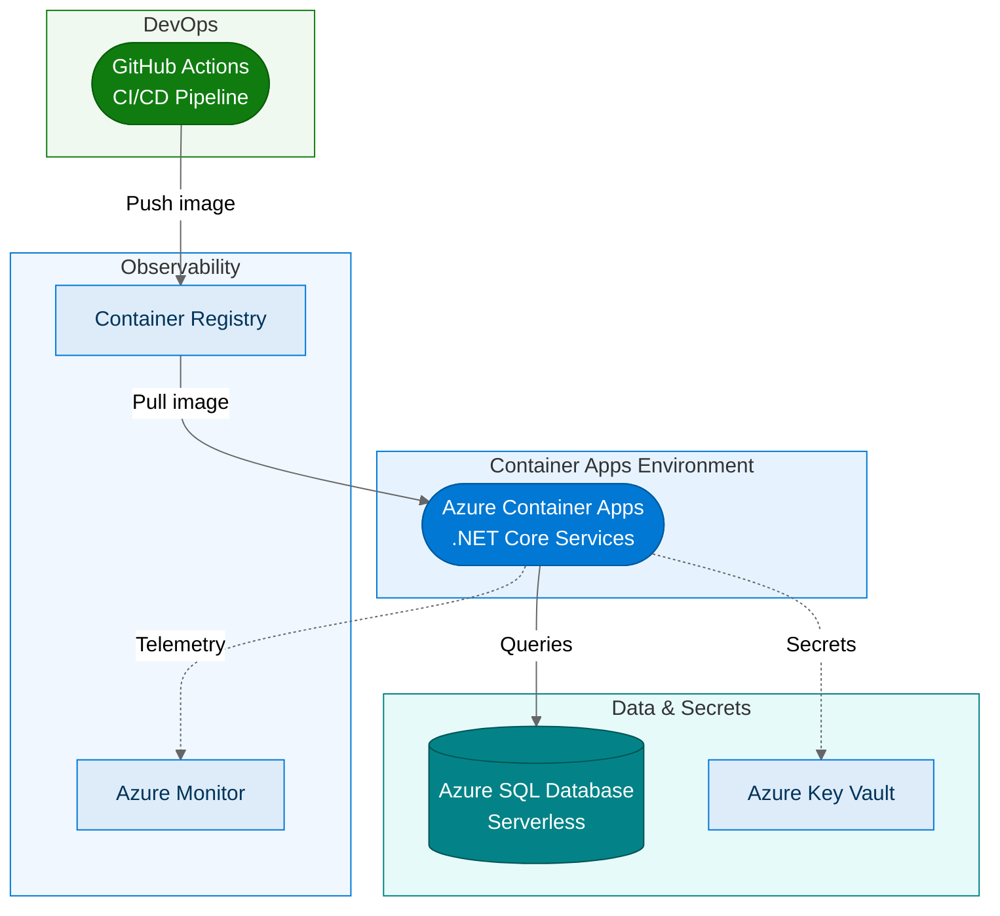

:::tip[TL;DR]
The Transform path containerizes .NET apps and migrates databases to Azure SQL
Database over **3–6 months**. The result: elastic autoscaling, CI/CD pipelines, and
lower operational overhead where PaaS and serverless fit the workload — at the
cost of deeper application and operating-model changes.
:::

Transform is the deeper modernization path. Applications are re-architected for
the cloud. Databases move to fully managed PaaS services. The result is a
modern, elastic, DevOps-ready platform that can evolve as fast as the business
needs it to. In the underlying Horizons model, this path maps to Horizon 2.

## What Changes

| On-Premises / Stabilize   | Transform Target                            | Benefit                                 |
| ------------------------- | ------------------------------------------- | --------------------------------------- |
| .NET Framework on IIS/VMs | **.NET (Core) on Azure Container Apps**     | Elastic scale, portable, CI/CD-ready    |
| SQL Server / SQL MI       | **Azure SQL Database**                      | Serverless scale, built-in intelligence |
| Manual deployment         | **GitHub Actions / Azure DevOps pipelines** | Automated, repeatable, auditable        |
| Monolithic architecture   | **Container-based services**                | Independent scaling and deployment      |

## The Architecture

## The .NET Modernization Path

Moving from .NET Framework to modern .NET is the core application change
in the Transform path. The approach depends on the application's complexity:

1. **Upgrade in place** — For well-structured applications, use the
   .NET Upgrade Assistant (or the newer GitHub Copilot modernization
   agent in Visual Studio) to migrate from .NET Framework to .NET 8+
   (or the latest LTS release)
2. **Strangler fig pattern** — For large monoliths, extract services
   incrementally while the legacy application continues to run
3. **Rewrite critical paths** — For deeply coupled code, rewrite the
   highest-value components as modern services

The containerized application runs on **Azure Container Apps** — a
serverless container platform that handles scaling, load balancing,
and ingress without managing Kubernetes directly.

## Why Azure SQL Database

Azure SQL Database is a different service from SQL Managed Instance.
Where SQL MI maximizes compatibility with on-premises SQL Server,
Azure SQL Database is designed for cloud-native workloads:

- **Serverless compute** — Scales to zero during idle periods (General
  Purpose tier), scales up automatically under load
- **Built-in intelligence** — Automatic tuning, threat detection,
  and performance recommendations
- **Elastic pools** — Share resources across multiple databases for
  cost efficiency
- **Hyperscale tier** — Scale to 128 TB with near-instant backups

:::note[Validate the economic model]
Serverless, elastic pools, and PaaS management can reduce waste and operations
effort, but savings are not automatic. Use Azure Migrate assessments, the
Azure TCO Calculator, and proof-of-concept telemetry to validate the target
SKU, scaling rules, and reservation strategy.
:::

## Before and After

| Dimension            | Before (Stabilize or on-prem) | After (Transform)                   |
| -------------------- | ----------------------------- | ----------------------------------- |
| **Application**      | .NET Framework on IIS / VMs   | .NET 8+ on Azure Container Apps     |
| **Database**         | SQL Server or SQL MI          | Azure SQL Database (serverless)     |
| **Deployment**       | Manual or scripted            | CI/CD via GitHub Actions            |
| **Scaling**          | Vertical (resize VM)          | Horizontal autoscale, scale-to-zero |
| **Cost model**       | Fixed VM costs                | Pay-per-use, serverless             |
| **Analytics**        | Limited or batch              | Real-time via Fabric mirroring      |
| **Typical timeline** | —                             | **3–6 months**                      |

:::tip[Not every workload needs Transform]
Transform delivers the most value for workloads that are actively
developed, customer-facing, or need to scale dynamically. For stable,
internal workloads, Stabilize with SQL Managed Instance is often the
better fit — and the smarter investment.
:::

## What Comes Next

With a containerized application and Azure SQL Database, you are
ready to add [Fabric integration via Azure SQL DB mirroring](/dc2fabric/horizons/h2-fabric/)
for a fully unified, AI-ready data platform.

[← Back to Stabilize + Fabric](/dc2fabric/horizons/h1-fabric/) · [Next: Transform + Fabric →](/dc2fabric/horizons/h2-fabric/)
