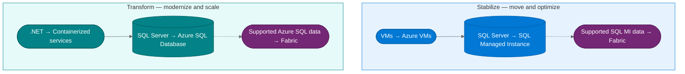
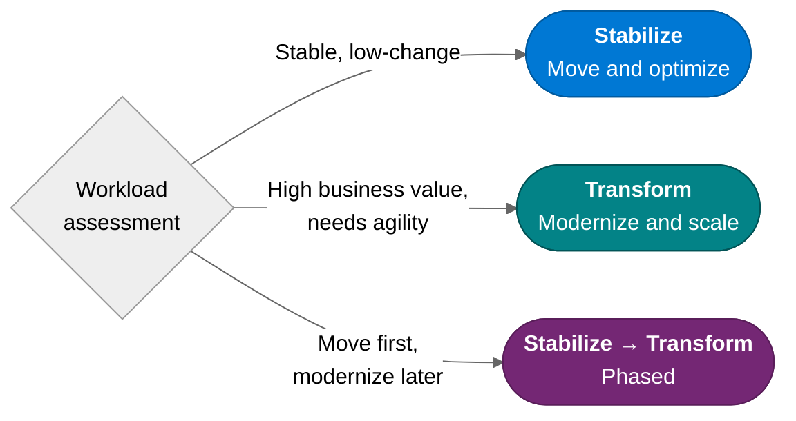

:::tip[TL;DR]
Every workload needs a deliberate path. **Stabilize** moves priority workloads
onto Azure with lower disruption. **Transform** modernizes applications, data
platforms, analytics foundations, and AI readiness where the business case
justifies deeper change.
:::

The assessment gave us the evidence. The next decision is not whether to
modernize everything at once. The decision is which path each workload should
follow so the customer gets value without unnecessary risk.

The Horizons model remains the planning method behind these two public paths:
Stabilize maps to Horizon 1, and Transform maps to Horizon 2.

## MCEM Stage 2 — Inspire and Design

Modernization path design is the second half of **MCEM Stage 2: Inspire and
Design**. We take assessment findings, overlay the customer's strategic
priorities, and produce a concrete plan that balances fast movement with deeper
transformation.

## The Two Paths

### Stabilize

Move workloads to Azure with minimal application changes. VMs migrate to Azure
VMs. SQL Server databases migrate to **Azure SQL Managed Instance** when
compatibility and operational continuity matter.

Choose Stabilize when the priority is to:

- reduce datacenter dependency quickly;
- lower application change risk;
- right-size infrastructure using assessment evidence;
- improve operations with managed patching, backup, monitoring, and resilience;
- enable Fabric mirroring for supported SQL MI tables when analytics is part of
  the strategy.

### Transform

Re-architect applications and data platforms for cloud-native benefits. .NET
Framework applications are upgraded where appropriate, containerized, and paired
with managed Azure data services such as **Azure SQL Database**.

Choose Transform when the priority is to:

- increase product agility and release frequency;
- support elastic or unpredictable demand;
- reduce operational overhead where PaaS and serverless fit the workload;
- establish modern DevOps and deployment practices;
- build richer governed data products in Fabric when readiness checks pass.

## Sequential, Parallel, or Both

The paths are not a rigid sequence. Strategy decides which pattern fits:

- **Some workloads stay Stabilize** because they are stable, well-understood,
  and do not need cloud-native change.
- **Some workloads go directly to Transform** because they are customer-facing,
  high-priority, or need capabilities that only a modern platform provides.
- **Some workloads start Stabilize and evolve to Transform** once the team is
  ready and the business case is clear.

:::note[Strategy decides, not technology]
The worst modernization programs try to modernize everything at once. The best
ones let business strategy determine the right path for each workload and
accept that not every system needs to become cloud-native.
:::

## Deep Dives

Explore each path and its Fabric integration in detail:

- [Stabilize Workloads](/dc2fabric/horizons/h1-lift-shift/)
- [Stabilize + Fabric](/dc2fabric/horizons/h1-fabric/)
- [Transform Platforms](/dc2fabric/horizons/h2-modernize/)
- [Transform + Fabric](/dc2fabric/horizons/h2-fabric/)

[← Back to Assessment](/dc2fabric/assessment/) · [Skip to Execution →](/dc2fabric/execution/)
