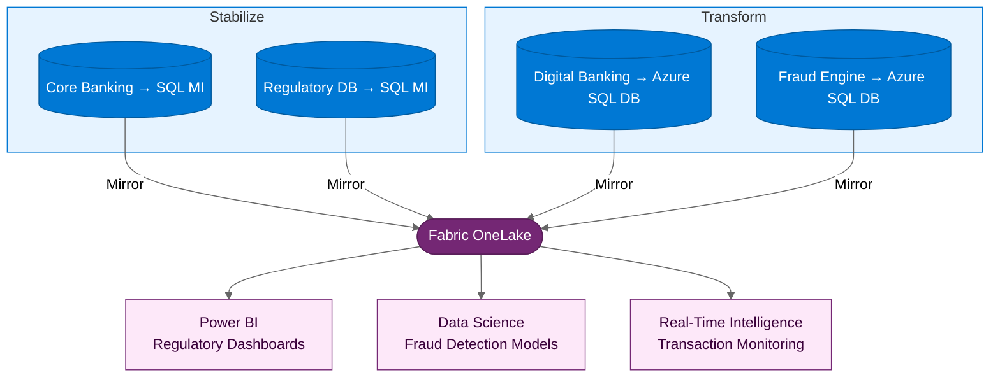

:::tip[TL;DR]
Woodgrove Bank: 340 VMs, 45 SQL databases, 28 .NET apps. Core banking
and regulatory systems follow Stabilize (months 1–5); digital banking and
fraud detection follow Transform (months 3–9). Fabric supports governed
reporting and near-real-time transaction monitoring when controls are configured.
:::

**Woodgrove Bank** is a regional bank with 200+ branches and a growing
digital banking platform. Decades of acquisitions have left them with
a fragmented IT estate — multiple core banking systems, overlapping
databases, and a compliance team that is perpetually behind on audits.

## The Challenge

Woodgrove faces a convergence of pressures:

- **Regulatory pressure** — New regulations require faster reporting,
  better data lineage, and demonstrated data sovereignty. The current
  manual audit process takes weeks and is error-prone.
- **Fraud detection gaps** — The existing fraud system is rule-based
  and batch-processed. Sophisticated fraud patterns are detected hours
  or days after the transaction — far too late.
- **Customer experience** — The digital banking app is built on .NET
  Framework and cannot handle traffic spikes during promotions or
  end-of-month salary processing.
- **Data silos** — Each acquired system has its own database. There is
  no unified view of customer relationships across products.

:::note[Why now?]
The regulator has issued new guidance requiring near-real-time transaction
monitoring by Q3 next year. Woodgrove's current batch-processing architecture
cannot meet this requirement.
Compliance failure carries significant financial and reputational risk.
:::

## The Assessment

Azure Migrate reveals the estate:

| Category             | Count | Finding                                                   |
| -------------------- | ----- | --------------------------------------------------------- |
| Windows Server VMs   | 340   | 240 migration-ready, 60 need remediation, 40 can retire   |
| .NET applications    | 28    | 20 are .NET Framework, 5 are .NET 6+, 3 are legacy VB.NET |
| SQL Server databases | 45    | 38 compatible with SQL MI, 7 need feature review          |

## The Path Decision

| Workload                       | Path          | Rationale                                                |
| ------------------------------ | ------------- | -------------------------------------------------------- |
| Core banking systems           | **Stabilize** | Stability is paramount, minimal-downtime cutover needed  |
| Regulatory reporting databases | **Stabilize** | Data sovereignty requirements met by SQL MI in-region    |
| Digital banking app            | **Transform** | Customer-facing, needs elastic scale and rapid iteration |
| Fraud detection engine         | **Transform** | Needs real-time processing, ML integration               |

## Execution

**Stabilize** (Months 1-5):

- Migrate core banking VMs in controlled waves with extended
  parallel-run validation (regulatory requirement)
- Migrate reporting databases to SQL Managed Instance
- Enable SQL MI Mirroring to Fabric for regulatory reporting

**Transform** (Months 3-9):

- Modernize digital banking: containerize, deploy to Container Apps
  with autoscaling for traffic spikes
- Rebuild fraud detection as a real-time service backed by Azure SQL
  Database and Fabric Real-Time Intelligence
- Full CI/CD with automated security scanning in pipeline

## The Payoff

**Business outcomes:**

- Regulatory reporting reduced from weeks to hours — automated dashboards
  in Power BI with lineage, ownership, and controls configured in Fabric and
  Microsoft Purview
- Near-real-time fraud detection using ML models trained on unified transaction
  data in Fabric, complementing the legacy batch-processing system during
  phased transition
- Digital banking app is designed and tested for traffic spikes with Azure
  Container Apps autoscaling and production performance validation
- Unified customer view across all acquired banking systems — for the
  first time, Woodgrove can analyze customer relationships across products
