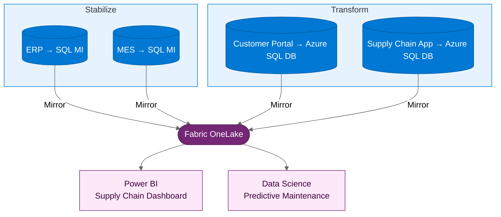

:::tip[TL;DR]
Contoso Industries: 127 VMs, 22 SQL databases, 14 .NET apps. ERP and MES
follow Stabilize (months 1–4); customer portal and supply chain dashboard
follow Transform (months 3–8). Fabric supports a near-real-time supply chain dashboard.
:::

**Contoso Industries** is a mid-sized manufacturer with 15 production
facilities across Europe. Their IT estate has grown organically over
two decades — reliable, but increasingly unable to support the business
decisions that leadership needs to make.

## The Challenge

Contoso's business is under pressure from multiple directions:

- **Supply chain disruption** — Global events have exposed the fragility
  of Contoso's just-in-time supply chain. Leadership wants near-real-time
  visibility into production, inventory, and supplier performance.
- **Aging infrastructure** — The on-premises data center runs 127 Windows
  Server VMs, including a critical ERP system built on .NET Framework 4.6
  with a SQL Server 2016 backend.
- **No analytics capability** — Production data is trapped in application
  databases. Monthly reports are generated manually from spreadsheet exports.
  There is no self-service BI and no predictive capability.
- **Skills gap** — The IT team excels at keeping the lights on but has
  limited cloud experience.

:::note[Why now?]
Contoso's CEO has committed to the board that the company will have
near-real-time supply chain visibility within 18 months. The existing
infrastructure cannot deliver this. The modernization program is not
an IT initiative — it is a board-level strategic priority.
:::

## The Assessment

Azure Migrate reveals the estate:

| Category             | Count | Finding                                               |
| -------------------- | ----- | ----------------------------------------------------- |
| Windows Server VMs   | 127   | 85 can migrate as-is, 30 need OS upgrade, 12 are idle |
| .NET applications    | 14    | 10 are .NET Framework 4.x, 4 are already .NET 6+      |
| SQL Server databases | 22    | 18 compatible with SQL MI, 4 need feature remediation |

## The Path Decision

| Workload                         | Path      | Rationale                                               |
| -------------------------------- | ------- | ------------------------------------------------------- |
| ERP system (core manufacturing)  | **Stabilize** | Business-critical, stable, no appetite for code changes |
| MES (shop floor execution)       | **Stabilize** | Tightly coupled to ERP, move together                   |
| Customer portal (order tracking) | **Transform** | Customer-facing, needs elastic scale for peak ordering  |
| Supply chain dashboard           | **Transform** | New development — build cloud-native from day one       |

## Execution

**Stabilize** (Months 1-4):

- Migrate 85 VMs to Azure in 4 waves
- Migrate ERP and MES databases to SQL Managed Instance
- Enable SQL MI Mirroring to Fabric for production data

**Transform** (Months 3-8):

- Modernize customer portal: .NET Framework → .NET 8, containerize
- Build new supply chain dashboard as a cloud-native application
- Both backed by Azure SQL Database, mirrored to Fabric

## The Payoff

**Business outcomes:**

- Near-real-time supply chain visibility — delivered to the CEO's dashboard
  in Power BI, with replication latency validated during rollout
- Predictive maintenance models trained on actual production data in
  Fabric, prioritizing equipment risk before maintenance windows
- Infrastructure cost reduction measured through Azure Migrate business-case
  assumptions, right-sizing, reservations, and PaaS adoption where appropriate
- IT team upskilled in Azure operations and Fabric analytics
