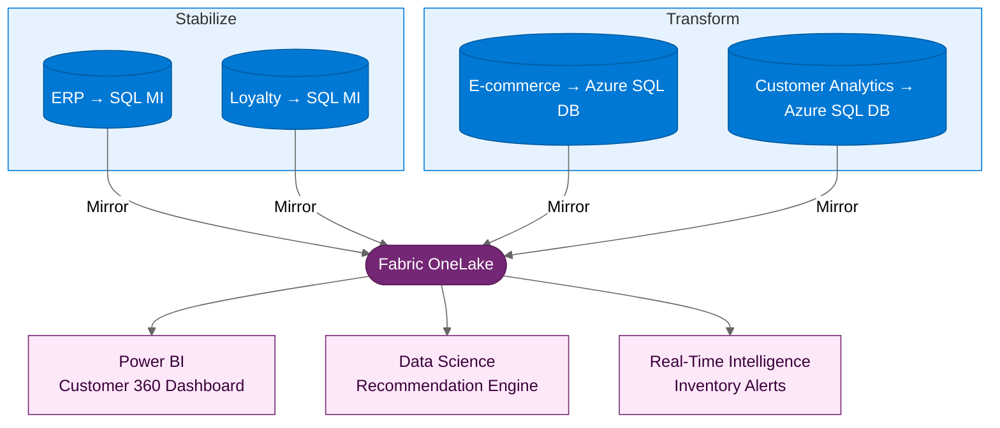

:::tip[TL;DR]
Northwind Traders: 65 VMs, 12 SQL databases, 8 .NET apps. ERP and
loyalty follow Stabilize (months 1–3); e-commerce and customer analytics
follow Transform (months 2–7). Fabric unifies the Customer 360 view across all channels.
:::

**Northwind Traders** is a specialty food retailer with 80 stores and
a fast-growing e-commerce platform. Their online business now accounts
for 40% of revenue — but the technology behind it was designed for 10%.

## The Challenge

Northwind's growth is creating urgent problems:

- **Seasonal scale failures** — Black Friday, holiday seasons, and flash
  sales regularly overwhelm the e-commerce platform. Last year's holiday
  sale crashed for 3 hours, costing an estimated €2M in lost revenue.
- **Siloed customer data** — In-store purchases, online orders, loyalty
  program activity, and customer service interactions are stored in
  separate systems. There is no unified Customer 360 view.
- **Slow time-to-market** — Deploying new features to the e-commerce
  platform takes 4-6 weeks due to manual testing and deployment processes.
  Competitors ship weekly.
- **Limited analytics** — Marketing decisions are based on monthly sales
  reports. There is no real-time visibility into customer behavior,
  inventory levels, or promotion effectiveness.

:::note[Why now?]
Northwind's CEO has announced a "digital-first" strategy. E-commerce
is expected to reach 60% of revenue within 2 years. The current
infrastructure cannot scale to meet this target — and every failed
peak-season event erodes customer trust.
:::

## The Assessment

Azure Migrate reveals the estate:

| Category             | Count | Finding                                                    |
| -------------------- | ----- | ---------------------------------------------------------- |
| Windows Server VMs   | 65    | 50 migration-ready, 10 need OS upgrade, 5 can retire       |
| .NET applications    | 8     | 5 are .NET Framework (including e-commerce), 3 are .NET 6+ |
| SQL Server databases | 12    | 10 compatible with SQL MI, 2 need feature review           |

## The Path Decision

| Workload                     | Path          | Rationale                                      |
| ---------------------------- | ------------- | ---------------------------------------------- |
| ERP and inventory management | **Stabilize** | Stable, back-office, moderate change frequency |
| Loyalty program backend      | **Stabilize** | Works well, just needs better infrastructure   |
| E-commerce platform          | **Transform** | Must scale elastically, needs rapid deployment |
| Customer analytics service   | **Transform** | New build — designed cloud-native from scratch |

## Execution

**Stabilize** (Months 1-3):

- Migrate ERP and loyalty VMs to Azure
- Migrate databases to SQL Managed Instance
- Enable SQL MI Mirroring to Fabric for inventory and loyalty data

**Transform** (Months 2-7):

- Modernize e-commerce: .NET 8, containerize, deploy to Container Apps
  with autoscaling rules for traffic spikes
- Build customer analytics service as a new cloud-native app with
  Azure SQL Database
- CI/CD pipeline with automated testing — deploy in hours, not weeks
- Both databases mirrored to Fabric

## The Payoff

**Business outcomes:**

- Peak-season resilience — Azure Container Apps autoscaling is tested against
  holiday traffic scenarios with rollback and performance thresholds agreed in
  advance
- Customer 360 view for the first time — in-store, online, and loyalty
  data unified in Fabric, powering personalized marketing and a
  recommendation engine
- Deployment cycle reduced from 6 weeks to same-day — the e-commerce
  team ships features weekly, matching competitor pace
- Near-real-time inventory visibility across stores and warehouse — enabling
  stockout reduction targets and more accurate online availability display
