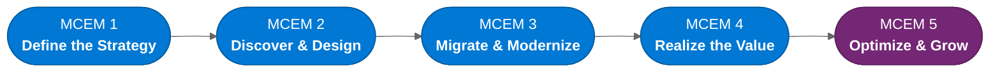
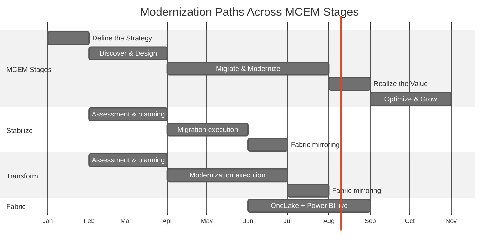

:::tip[TL;DR]
The dc2fabric journey maps to five MCEM stages — Define the Strategy,
Discover & Design, Migrate & Modernize, Realize the Value, Optimize &
Grow. Stabilize and Transform paths can run in overlapping phases across
Stages 2–4, with Fabric going live as mirroring is enabled. Stage 5 is ongoing.
:::

This page maps the entire dc2fabric journey across the five stages of the
Microsoft Customer Engagement Methodology (MCEM). Each stage builds on
the previous one, with clear activities, outcomes, and decision points.

## The Full Journey

## Stage-by-Stage Breakdown

### Stage 1 — Listen and Consult

**Focus:** Understand the customer's business, not their technology.

| Activity                                             | Outcome                                     |
| ---------------------------------------------------- | ------------------------------------------- |
| Discovery conversations with business and IT leaders | Shared understanding of business pressures  |
| Cloud Adoption Framework — Strategy phase            | Documented motivations and desired outcomes |
| Cloud Adoption Framework — Plan phase                | Prioritized workload list                   |
| Stakeholder alignment workshops                      | Executive sponsorship and shared vision     |

**Decision gate:** Does cloud modernization align with the customer's
strategic priorities? If yes, proceed to assessment.

### Stage 2 — Inspire and Design

**Focus:** Show what is possible with evidence, and design the roadmap.

| Activity                               | Outcome                                        |
| -------------------------------------- | ---------------------------------------------- |
| Azure Migrate discovery and assessment | Complete inventory of VMs, apps, databases     |
| Infrastructure readiness analysis      | Migration readiness scores per workload        |
| Application compatibility analysis     | .NET version map and modernization complexity  |
| Database compatibility analysis        | SQL feature usage and Azure SQL target mapping |
| Modernization path workshop            | Workloads assigned to Stabilize or Transform   |
| Architecture design per path           | Target architecture diagrams                   |
| Fabric integration planning            | Data mirroring strategy                        |
| Migration wave planning                | Dependency-based phased execution roadmap      |

**Decision gate:** Does the assessment confirm the estate is suitable for
migration? Is the modernization path roadmap approved by the customer?

### Stage 3 — Empower and Achieve

**Focus:** Execute the migration and build customer capability.

| Activity                               | Outcome                                        |
| -------------------------------------- | ---------------------------------------------- |
| Stabilize: VM migration waves          | Workloads running on Azure VMs                 |
| Stabilize: SQL MI migration            | Databases on SQL Managed Instance              |
| Transform: .NET upgrade and containers | Apps on Azure Container Apps                   |
| Transform: Azure SQL DB migration      | Databases on Azure SQL Database                |
| Fabric mirroring configuration         | Operational data flowing to OneLake            |
| Cutover and rollback approval          | Business-approved production moves             |
| Post-cutover validation                | Functional, performance, and security sign-off |

**Decision gate:** Are all workloads validated and performing as expected
in Azure? Is the on-premises environment ready for decommission?

### Stage 4 — Realize Value

**Focus:** Measure outcomes against the original business strategy.

| Activity                          | Outcome                                        |
| --------------------------------- | ---------------------------------------------- |
| Cost optimization review          | Validated TCO reduction                        |
| Operational efficiency assessment | Reduced manual effort, faster deployments      |
| Analytics platform review         | Fabric dashboards delivering business insights |
| Skills assessment                 | Customer team operating independently          |

### Stage 5 — Manage and Optimize

**Focus:** Continuously improve and expand the Azure and Fabric estate.

| Activity                         | Outcome                                        |
| -------------------------------- | ---------------------------------------------- |
| Ongoing cost optimization        | Azure Advisor reviews, reservation adjustments |
| Operational maturity advancement | Proactive monitoring, automated remediation    |
| Fabric workload expansion        | New data sources, new dashboards, AI/ML models |
| Stabilize → Transform assessment | Periodic review of Stabilize workloads         |
| Continuous improvement planning  | Roadmap for next engagement cycle              |

## Modernization Paths Across MCEM

The following shows when each path activates across the MCEM stages:

:::note[Every organization's timeline is different]
The Gantt chart above is illustrative. A small estate might complete in
3 months. A large enterprise might take 12-18 months. The structure is
the same — the timeline scales with estate size, dependency complexity,
governance requirements, and customer readiness.
:::
