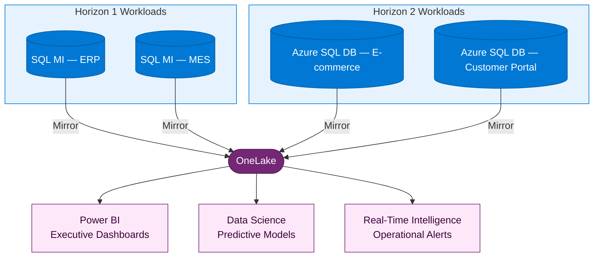

:::tip[TL;DR]
H1 delivers 30–40% typical cost savings; H2 delivers 40–60% (use the
[Azure TCO Calculator](https://azure.microsoft.com/pricing/tco/calculator/)
for your estimate). Both horizons feed data into Fabric via mirroring,
creating a unified analytics platform. MCEM Stage 5 ensures continuous
optimization beyond the initial migration.
:::

The workloads are migrated. The analytics platform is live. Now we
measure the outcomes against the business strategy we defined at the
very beginning — and demonstrate that modernization delivered real,
measurable value.

## MCEM Stage 4 — Realize Value

This is **MCEM Stage 4: Realize Value**. The customer sees the results
of their investment — not in technical metrics, but in business outcomes
that matter to their leadership team.

## Outcomes by Horizon

| Outcome                    | Horizon 1                                                    | Horizon 2                                             |
| -------------------------- | ------------------------------------------------------------ | ----------------------------------------------------- |
| **Infrastructure cost**    | ~30-40% typical reduction (right-sizing + reserved instances)| ~40-60% typical reduction (PaaS + serverless)         |
| **Operational overhead**   | Managed patching, backups, and HA replace manual processes   | Fully managed platform — no infrastructure to operate |
| **Time to deploy changes** | Days (same as before, but on better infrastructure)          | Minutes (CI/CD pipelines with automated testing)      |
| **Scale capability**       | Vertical scaling within VM SKU families                      | Elastic horizontal scaling, scale-to-zero             |
| **Analytics latency**      | Near-real-time via SQL MI Mirroring                          | Near-real-time via Azure SQL DB Mirroring             |

:::note[Cost savings are estimates]
Actual savings vary by workload, SKU selection, and usage patterns. Use the
[Azure TCO Calculator](https://azure.microsoft.com/pricing/tco/calculator/)
and [Azure Migrate business case](https://learn.microsoft.com/azure/migrate/how-to-view-a-business-case)
for customer-specific projections.
:::

## Fabric as the Unifier

Regardless of which horizon each workload followed, all data converges
in Microsoft Fabric. This is the strategic payoff of the entire journey:

:::tip[One platform, not two]
The customer does not need to build separate analytics solutions for H1
and H2 workloads. Fabric unifies everything in OneLake. As workloads
evolve from H1 to H2, the data gets richer — but the analytics platform
is already in place and serving value from day one.
:::

## The Journey Does Not End

Modernization is a journey, not a big bang. After the initial migration:

- **H1 workloads** continue to deliver value and can evolve to H2 when
  the business case justifies it
- **H2 workloads** continue to modernize — adopting new Azure services,
  improving resilience, expanding capabilities
- **Fabric** grows with the business — new data sources, new analytics
  use cases, new AI models
- **The team** continues to develop cloud skills and operational maturity

The Horizons model ensures that every step forward delivers measurable
value — and that no step requires a disruptive, high-risk transformation.

**Modernization is a journey, not a big bang.**

## MCEM Stage 5 — Manage and Optimize

The journey does not end at value realization. **MCEM Stage 5: Manage and
Optimize** ensures the customer continues to extract and grow value from
their Azure and Fabric investments:

- **Cost optimization** — Regular reviews with Azure Advisor and Cost
  Management to right-size, eliminate waste, and adjust reservations
- **Operational maturity** — Evolve from reactive operations to proactive
  monitoring, automated remediation, and SRE practices
- **Fabric expansion** — Onboard new data sources, build additional Power BI
  dashboards, and introduce AI/ML workloads as the data estate grows.
  Emerging capabilities like [Fabric IQ](https://learn.microsoft.com/fabric/iq/overview)
  (unified data contextualization) and
  [Foundry IQ](https://learn.microsoft.com/azure/foundry/agents/concepts/what-is-foundry-iq)
  (AI agents reasoning over governed data) extend the platform further
- **Governance maturity** — Use [Microsoft Purview](https://learn.microsoft.com/azure/cloud-adoption-framework/data/governance-security-baselines-purview-data-estate-unify-data-platform)
  for unified data governance, classification, and compliance across the
  full data estate — OneLake, Azure, on-premises, and third-party sources
- **H1 → H2 evolution** — Re-evaluate H1 workloads periodically; when the
  business case justifies modernization, plan the transition to H2
- **Skills development** — Continue upskilling the customer team in Azure,
  Fabric, and DevOps practices

:::note[MCEM is cyclical]
Stage 5 feeds back into Stage 1. New business needs, new workloads, or
new Azure capabilities may trigger the next engagement cycle — but with a
team that is already cloud-capable and a platform already in place.
:::

[← Back to Execution](/dc2fabric/execution/) · [View Full Journey Map →](/dc2fabric/journey-map/)
